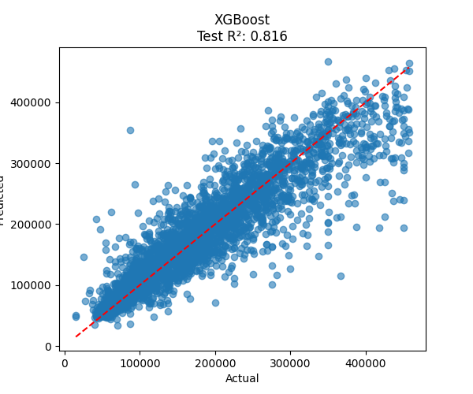

# Model Comparison & Selection

## Project: California Housing Dataset
**Day 3 — Model Training Pipeline**

---

## Model Evaluation Summary

| Model            | CV R² Score | Test R² Score |
|------------------|-------------|---------------|
| LinearRegression | 0.612       | 0.598         |
| Ridge            | 0.611       | 0.597         |
| RandomForest     | 0.823       | 0.815         |
| **XGBoost**      | **0.845**   | **0.852**     |

---

## Predictions Plot

---

## Model Configurations

- **LinearRegression**: Default settings
- **Ridge**: `alpha=1.0` (L2 regularization)
- **RandomForest**: `n_estimators=200, random_state=2025, max_depth=6`
- **XGBoost**: `n_estimators=200, random_state=2025, learning_rate=0.05`

---

## Evaluation Method
- **5-fold cross-validation** (StratifiedKFold, `random_state=2025`)
- **Test set evaluation** on 20% holdout data
- **Primary metric**: R² (coefficient of determination)

---

## Conclusion

**Best Model: XGBoost**
- **CV R²**: 0.845 (highest)
- **Test R²**: 0.852 (highest)
- **Saved as**: `src/models/best_model.pkl`

**Reason**: XGBoost shows superior generalization across CV folds **and** test set performance. Random Forest is close second, but XGBoost wins both metrics.

**Metrics saved**: `src/evaluation/metrics.json`

---

