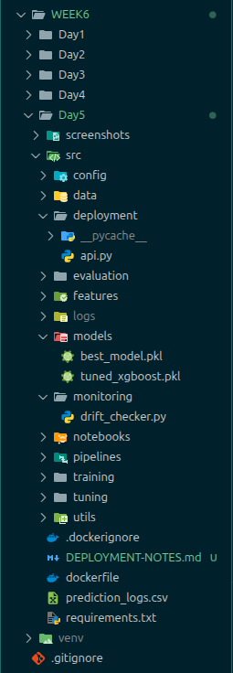
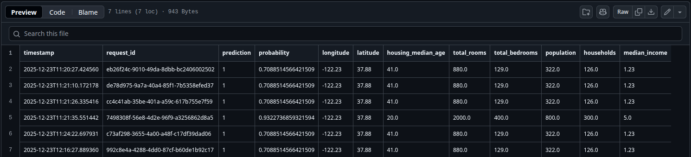

=========================================
DAY 5 - HOUSE PRICE CLASSIFIER DEPLOYMENT 
=========================================

Day5
----

1. API: Running & Predicting
2. Logs: prediction_logs.csv (created)
3. Drift: Monitoring working (DRIFT detected)
4. Docker: Built & Ready
5. Model: Loaded successfully

CURRENT STRUCTURE (Day5/)
========================

QUICK START COMMANDS
================
# 1. LOCAL API (Terminal 1)
source venv/bin/activate
uvicorn src.deployment.api:app --host 0.0.0.0 --port 8000 --reload

# 2. TEST API (Terminal 2)
curl -X POST http://localhost:8000/predict \
  -H "Content-Type: application/json" \
  -d '{"longitude":-122.23,"latitude":37.88,"housing_median_age":41,"total_rooms":880,"total_bedrooms":129,"population":322,"households":126,"median_income":1.23}'

# 3. CHECK LOGS
tail prediction_logs.csv

# 4. DRIFT MONITORING
python3 monitoring/drift_checker.py
Output: {'total_bedrooms': 'DRIFT', 'population': 'DRIFT', ...}

# 5. DOCKER (Production)
docker build -t house-classifier -f deployment/Dockerfile .
docker run -p 8000:8000 house-classifier

EXPECTED RESPONSES
================
HEALTH:        {"status": "ok", "model_loaded": True}
PREDICTION:    {"request_id": "uuid", "prediction": 0, "probability": 0.456}
DRIFT:         {'longitude': 'DRIFT', 'latitude': 'OK', ...}

ENDPOINTS WORKING
================

GET    http://localhost:8000/          # Status

POST   http://localhost:8000/predict   # Classify house

GET    http://localhost:8000/health    # Health check

