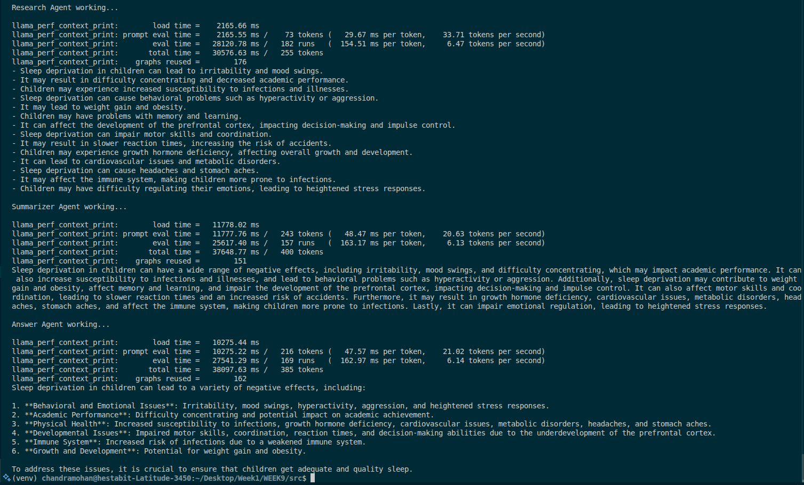

# Agent Fundamentals - Day 1

## Overview
Implementation of a multi-agent system using AutoGen 0.7.5 with message-based communication and role isolation.

## Architecture

### Agent Pipeline
```
User Query → Research Agent → Summarizer Agent → Answer Agent → Final Response
```

### Core Concepts
- **Perception → Reasoning → Action Loop**: Each agent perceives input, reasons about it, and produces output
- **ReAct Pattern**: Agents reason about their role and act accordingly
- **Role Isolation**: Strict separation of responsibilities
- **Message Protocol**: Async communication via `run()` method

## Agent Specifications

**Configuration**:
- Model: Qwen2.5-7B-Instruct Q4_0 GGUF
- Context window: 2048 tokens
- Memory buffer: 10 messages
- Output: Raw research data, Condensed summary, Actionable final answer

## Key Design Decisions

### 1. Memory Window (buffer_size=10)
**Purpose**: Limit context to last 10 messages per agent

**Benefits**:
- Consistent inference speed across long conversations
- Prevents memory overflow (KV cache growth)
- Maintains low latency (~15-20 tok/s on CPU)
- Removes noise from old messages

**Trade-off**: Agent cannot reference information beyond 10 messages (acceptable for single-pass pipeline)

### 2. Strict Job Separation
**Why**: Prevents agents from overstepping boundaries

**Implementation**:
- Explicit role definitions in system prompts
- Negative instructions ("Do NOT summarize", "Do NOT provide final answers")
- Clear handoff points between agents

**Result**: Clean separation of concerns, predictable behavior

### 3. Async Message Protocol
**Pattern**: `await agent.run(task=input_string)`

**Returns**: `TaskResult` object
- Access messages: `result.messages`
- Get final response: `result.messages[-1].content`

**Why async**: Enables parallel agent execution in future iterations

## File Structure
```
WEEK9/
├── src/
│   ├── agents/
│   │   ├── research_agent.py      # Research Agent definition
│   │   ├── summarizer_agent.py    # Summarizer Agent definition
│   │   ├── answer_agent.py        # Answer Agent definition
│   │   └── run_agents.py          # Pipeline orchestration
│   ├── models/
│       └── qwen2.5-7b-instruct-q4_0.gguf
│   
│       
└── venv/
```

## Example Run



## Performance Metrics

### Model Specifications
- **Model**: Qwen2.5-7B-Instruct (Q4_0 quantization)
- **Size**: ~4.4GB
- **Context**: 131K max, 2048 used
- **Inference**: CPU-only (llama.cpp backend)

### Latency (per agent call)
- Research Agent: ~3-5 seconds
- Summarizer Agent: ~2-3 seconds
- Answer Agent: ~2-4 seconds
- **Total pipeline**: ~8-12 seconds

### Token Throughput
- **Average**: 15-20 tokens/second (CPU)
- Consistent across all agents due to buffer_size=10

## Requirements
- autogen-agentchat : Provides `AssistantAgent` class for building LLM-powered agents
- autogen-core : Required by autogen-agentchat / Foundation layer for AutoGen framework
- autogen-ext : Extension package for additional model backends
- asyncio : Python's built-in async/await framework
- autogen-ext[llama-cpp] : Llama.cpp integration with `LlamaCppChatCompletionClient` for local GGUF model inference via CPU